# Experiments-For-Dissertation

> 多无人机协同目标分配实验平台 — 基于离散映射差分进化 (DMDE) 与 LLM 增强

## 项目架构

### 模块依赖图

```mermaid
graph TB
    classDef exp fill:#e1f5fe,stroke:#0288d1,stroke-width:2px
    classDef algo fill:#e8f5e9,stroke:#388e3c,stroke-width:2px
    classDef llm fill:#fff3e0,stroke:#f57c00,stroke-width:2px
    classDef core fill:#f3e5f5,stroke:#7b1fa2,stroke-width:2px
    classDef infra fill:#fafafa,stroke:#616161,stroke-width:1px

    subgraph Experiments ["实验层 experiments/"]
        direction TB
        E1["exp_dmde<br/>(01/02/03)"]:::exp
        E2["exp_llm_enhanced_EA<br/>(01/02/03)"]:::exp
    end

    subgraph Algorithms ["算法层 src/algorithms/"]
        direction TB

        subgraph DMDE ["algorithm_dmde"]
            direction TB
            D_solver["solvers/<br/>DMDESolver"]:::algo
            D_ops["operators/<br/>crossover · mutation<br/>scale_factor · extinction"]:::algo
            D_repr["representation/<br/>encoder · mapper<br/>inverse_mapper · repair_rules"]:::algo
            D_base["base/<br/>BaseOptimizer"]:::algo
        end

        subgraph LLM_DMDE ["algorithm_llm_enhanced_dmde"]
            direction TB
            LLM_solver["solvers/<br/>LLMEnhancedDMDESolver"]:::algo

            subgraph LLM_Layer ["llm/ (可插拔模块)"]
                direction TB
                LLM_base["BaseLLMModule<br/>+ ModuleState"]:::llm
                LLM_client["LLMClient"]:::llm
                LLM_pop["population_init"]:::llm
                LLM_op["operator_selection"]:::llm
                LLM_cr["cr_control"]:::llm
            end

            LLM_traj["trajectory/<br/>OptimizationTrajectory"]:::infra
            LLM_feat["features/<br/>population · convergence<br/>· constraint"]:::infra
            LLM_ops["operators/<br/>(DMDE 独立副本)"]:::algo
            LLM_repr["representation/<br/>(DMDE 独立副本)"]:::algo
            LLM_base2["base/<br/>BaseOptimizer"]:::algo
        end
    end

    subgraph EnvModel ["环境 & 模型层"]
        direction TB
        ENV["environments/<br/>environment_dmde<br/>DEM · Radar · CostEstimator"]:::core
        MOD["models/<br/>model_dmde<br/>UAV · Target · CostMatrix<br/>Constraints · FitnessEvaluator"]:::core
        UTIL["utils/<br/>utils_dmde<br/>metrics"]:::infra
    end

    subgraph Tests ["测试层 tests/"]
        direction LR
        T1["dmde/"]:::infra
        T2["llm_enhanced_dmde/"]:::infra
    end

    %% 实验 → 算法
    E1 -->|导入| D_solver
    E2 -->|导入| LLM_solver

    %% DMDE 内部依赖
    D_solver --> D_ops
    D_solver --> D_repr
    D_solver --> D_base
    D_ops --> D_repr

    %% LLM-DMDE 内部依赖
    LLM_solver --> LLM_ops
    LLM_solver --> LLM_repr
    LLM_solver --> LLM_base2
    LLM_solver --> LLM_Layer
    LLM_solver --> LLM_traj
    LLM_solver --> LLM_feat
    LLM_ops --> LLM_repr

    %% LLM 模块 → LLM 客户端
    LLM_pop --> LLM_client
    LLM_op --> LLM_client
    LLM_cr --> LLM_client
    LLM_pop --> LLM_base
    LLM_op --> LLM_base
    LLM_cr --> LLM_base

    %% 两个算法模块 → 共享环境/模型层
    D_solver --> ENV
    D_solver --> MOD
    D_solver --> UTIL
    LLM_solver --> ENV
    LLM_solver --> MOD
    LLM_solver --> UTIL

    %% 测试
    T1 -.-> D_solver
    T2 -.-> LLM_solver
```



### 图例

| 颜色 | 层级 | 说明 |
|------|------|------|
| 🔵 蓝色 | 实验层 | `experiments/` — 可运行的实验脚本 |
| 🟢 绿色 | 算法层 | `src/algorithms/` — DMDE 与 LLM-DMDE 求解器 |
| 🟠 橙色 | LLM 模块 | `llm/modules/` — 可插拔、可消融的 LLM 增强模块 |
| 🟣 紫色 | 核心层 | `environments/` + `models/` — 问题建模与环境 |
| ⚪ 灰色 | 基础层 | `utils/` + `trajectory/` + `features/` — 工具与数据结构 |

---

## 目录结构

```
Experiments-For-Dissertation/
│
├── src/                                          # 核心源码
│   ├── algorithms/
│   │   ├── algorithm_dmde/                       # DMDE 基线算法（第三章）
│   │   │   ├── base/         BaseOptimizer + SolverResult
│   │   │   ├── operators/    crossover · mutation · scale_factor · extinction
│   │   │   ├── representation/  encoder · mapper · inverse_mapper · repair_rules/
│   │   │   └── solvers/      DMDESolver + baseline_solvers/
│   │   │
│   │   └── algorithm_llm_enhanced_dmde/          # LLM 增强 DMDE（独立实现）
│   │       ├── base/         BaseOptimizer（独立副本）
│   │       ├── operators/    DMDE 算子（独立副本）
│   │       ├── representation/  编码/映射/修复（独立副本）
│   │       ├── solvers/      LLMEnhancedDMDESolver
│   │       ├── llm/          LLM 交互层
│   │       │   ├── base_module.py    BaseLLMModule + ModuleState
│   │       │   ├── llm_client.py     OpenAI 兼容 API 客户端
│   │       │   └── modules/          可插拔 LLM 模块
│   │       │       ├── population_init.py     种群初始化建议
│   │       │       ├── operator_selection.py  DE 算子策略选择
│   │       │       └── cr_control.py          CR/F 动态控制
│   │       ├── features/     搜索状态特征提取
│   │       └── trajectory/   OptimizationTrajectory 轨迹记录
│   │
│   ├── environments/environment_dmde/            # 战场环境（DEM · 雷达 · 代价估算）
│   ├── models/model_dmde/                        # 领域模型（UAV · Target · 约束 · 代价矩阵）
│   └── utils/utils_dmde/                         # 工具函数（评价指标）
│
├── experiments/                                  # 实验层
│   ├── exp_dmde/                                 # DMDE 基线实验
│   │   ├── exp_dmde_01/    N=M 平衡指派
│   │   ├── exp_dmde_02/    N>M 多对一
│   │   └── exp_dmde_03/    N<M 群巡游
│   └── exp_llm_enhanced_EA/                      # LLM 增强实验
│       ├── exp_dmde_01/    LLM + N=M（含 llm_config.yaml）
│       ├── exp_dmde_02/    LLM + N>M
│       └── exp_dmde_03/    LLM + N<M
│
├── tests/                                        # 单元测试
│   ├── dmde/               DMDE 算法测试
│   └── llm_enhanced_dmde/  LLM 模块测试
│
└── docs/                                         # 文档
    ├── AI_guide/             LLM 增强设计指南
    ├── DIRECTORY_STRUCTURE.md
    ├── references/           参考论文
    └── reviews/              代码审查报告
```

---

## LLM 消融实验

通过 `modules` 配置字典控制 LLM 模块的启用/禁用：

```python
from algorithms.algorithm_llm_enhanced_dmde import LLMEnhancedDMDEConfig

# Vanilla DMDE（无 LLM）
cfg = LLMEnhancedDMDEConfig(modules={})

# 仅 LLM 算子选择
cfg = LLMEnhancedDMDEConfig(modules={
    "operator_selection": {"enabled": True, "interval": 50}
})

# 仅 LLM CR/F 控制
cfg = LLMEnhancedDMDEConfig(modules={
    "cr_control": {"enabled": True, "interval": 10}
})

# 仅 LLM 种群初始化
cfg = LLMEnhancedDMDEConfig(modules={
    "population_init": {"enabled": True}
})

# 全部启用
cfg = LLMEnhancedDMDEConfig(modules={
    "population_init": {"enabled": True},
    "operator_selection": {"enabled": True, "interval": 50},
    "cr_control": {"enabled": True, "interval": 10},
})
```

---

## 快速开始

```bash
# 安装依赖
uv sync

# 运行 DMDE 基线实验
python experiments/exp_dmde/exp_dmde_01/run.py

# 运行 LLM 增强实验（需配置 API）
python experiments/exp_llm_enhanced_EA/exp_dmde_01/run.py

# 运行测试
pytest tests/
```
