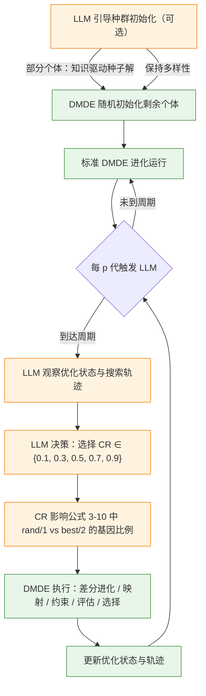
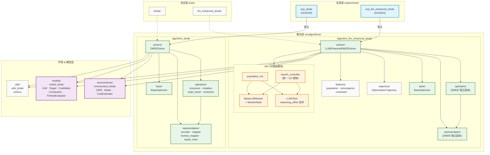

# Experiments-For-Dissertation

> 多无人机协同目标分配实验平台 — 基于离散映射差分进化 (DMDE) 与 LLM 增强

## LLM-DMDE 框架设计

### 概述

LLM-DMDE 采用**分层干预框架**，LLM 在两个层级参与进化优化过程：

1. **种群初始化干预**（可选） — LLM 为部分个体提供知识驱动的种子解，其余个体由原始 DMDE 初始化机制生成以保持种群多样性。
2. **搜索控制** — 每隔 _p_ 代，LLM 观察当前优化状态与近期搜索轨迹，自适应选择交叉率 CR。CR 天然影响公式 3-10 中 `DE/rand/1`（探索）与 `DE/best/2`（开发）的基因比例，从而间接控制搜索策略。

通过上述设计，LLM-DMDE 将**高层自适应参数决策**与**低层数值进化**解耦：LLM 负责"用多大的 CR 搜索"，DMDE 负责差分进化、离散-连续映射、逆映射、约束处理、目标评估和环境选择。

### 核心机制：LLM 通过 CR 控制搜索策略

原始 DMDE 的混合策略（公式 3-10）中，每个基因独立掷骰：

- `rand <= CR` → 使用 `DE/rand/1`（探索）
- `rand > CR` → 使用 `DE/best/2`（开发）

因此 CR 值直接决定了种群中探索与开发的基因比例：

| CR 值   | rand/1 基因比例 | 搜索倾向 | 适用场景               |
| ------- | -------------- | -------- | ---------------------- |
| 0.1/0.3 | 低             | 开发为主 | 多样性高、收敛慢       |
| 0.5     | 中等           | 平衡     | 一般情况               |
| 0.7/0.9 | 高             | 探索为主 | 多样性低、停滞严重     |

LLM 根据优化状态（多样性、停滞、可行解比例等）动态选择 CR，间接控制搜索策略，同时保留原始 DMDE 的逐基因随机混合机制。

### 三层干预详解

#### 第一层：LLM 引导的种群初始化（可选）

- 采用可选的 LLM 引导种群初始化模块，为部分个体提供基于领域知识的种子解
- 剩余个体使用原始 DMDE 初始化机制随机生成，确保种群多样性
- 初始化完成后，标准 DMDE 作为底层数值优化引擎开始运行

#### 第二层：搜索控制（CR 自适应选择）

- 进化过程中，LLM 每隔 _p_ 代观察一次当前优化状态和近期搜索轨迹
- 基于观察信息，LLM 选择交叉率 CR（从 {0.1, 0.3, 0.5, 0.7, 0.9} 中选取）
- 缩放因子 F 按原始 DMDE 公式 3-11 由 CR 批量计算（每个个体独立 F 值）
- CR 决定后续 _p_ 代的搜索倾向（探索 vs 开发），之后优化状态和轨迹更新并反馈给 LLM 进行下一轮决策

### LLM 与 DMDE 职责边界

| 职责                   | LLM                          | DMDE                |
| ---------------------- | ---------------------------- | ------------------- |
| 种群初始化（种子解）   | ✅ 提供知识驱动的种子解（可选） | ✅ 随机生成剩余个体 |
| 交叉率 CR 确定         | ✅ 自适应选择                | —                   |
| 缩放因子 F 计算        | —                            | ✅ 由 CR 按公式 3-11 批量计算 |
| 混合变异策略执行       | —                            | ✅ 逐基因随机选择 rand/1 或 best/2 |
| 差分进化执行           | —                            | ✅                  |
| 离散-连续映射 / 逆映射 | —                            | ✅                  |
| 约束处理               | —                            | ✅                  |
| 目标评估               | —                            | ✅                  |
| 环境选择               | —                            | ✅                  |
| 搜索状态观测与决策     | ✅ 每 _p_ 代观测并决策       | —                   |

### 框架流程图



---

## 项目架构

### 模块依赖图



### 图例

| 颜色    | 层级     | 说明                                                    |
| ------- | -------- | ------------------------------------------------------- |
| 🔵 蓝色 | 实验层   | `experiments/` — 可运行的实验脚本                       |
| 🟢 绿色 | 算法层   | `src/algorithms/` — DMDE 与 LLM-DMDE 求解器             |
| 🟠 橙色 | LLM 模块 | `llm/modules/` — 可插拔、可消融的 LLM 增强模块          |
| 🟣 紫色 | 核心层   | `environments/` + `models/` — 问题建模与环境            |
| ⚪ 灰色 | 基础层   | `utils/` + `trajectory/` + `features/` — 工具与数据结构 |

---

## 目录结构

```
Experiments-For-Dissertation/
│
├── src/                                          # 核心源码
│   ├── algorithms/
│   │   ├── algorithm_dmde/                       # DMDE 基线算法（第三章）
│   │   │   ├── base/         BaseOptimizer + SolverResult
│   │   │   ├── operators/    crossover · mutation · scale_factor · extinction
│   │   │   ├── representation/  encoder · mapper · inverse_mapper · repair_rules/
│   │   │   └── solvers/      DMDESolver + baseline_solvers/
│   │   │
│   │   └── algorithm_llm_enhanced_dmde/          # LLM 增强 DMDE（独立实现）
│   │       ├── base/         BaseOptimizer（独立副本）
│   │       ├── operators/    DMDE 算子（独立副本）
│   │       ├── representation/  编码/映射/修复（独立副本）
│   │       ├── solvers/      LLMEnhancedDMDESolver
│   │       ├── llm/          LLM 交互层
│   │       │   ├── base_module.py    BaseLLMModule + ModuleState
│   │       │   ├── llm_client.py     OpenAI 兼容 API 客户端（含 reasoning_effort）
│   │       │   └── modules/          可插拔 LLM 模块
│   │       │       ├── population_init.py     种群初始化建议
│   │       │       └── search_controller.py   统一搜索控制器（CR 自适应选择）
│   │       ├── features/     搜索状态特征提取
│   │       └── trajectory/   OptimizationTrajectory 轨迹记录
│   │
│   ├── environments/environment_dmde/            # 战场环境（DEM · 雷达 · 代价估算）
│   ├── models/model_dmde/                        # 领域模型（UAV · Target · 约束 · 代价矩阵）
│   └── utils/utils_dmde/                         # 工具函数（评价指标）
│
├── experiments/                                  # 实验层
│   ├── exp_dmde/                                 # DMDE 基线实验
│   │   ├── exp_dmde_01/    N=M 平衡指派
│   │   ├── exp_dmde_02/    N>M 多对一
│   │   └── exp_dmde_03/    N<M 群巡游
│   └── exp_llm_enhanced_dmde/                    # LLM 增强实验
│       ├── exp_llm_dmde_01/  LLM + N=M（含 config/llm_config.yaml）
│       ├── exp_llm_dmde_02/  LLM + N>M
│       └── exp_llm_dmde_03/  LLM + N<M
│
├── tests/                                        # 单元测试
│   ├── dmde/               DMDE 算法测试
│   └── llm_enhanced_dmde/  LLM 模块测试（含 llm_client 测试）
│
└── docs/                                         # 文档
    ├── AI_guide/             LLM 增强设计指南
    ├── DIRECTORY_STRUCTURE.md
    ├── references/           参考论文
    └── reviews/              代码审查报告
```

---

## LLM 配置

### 基本配置（llm_config.yaml）

```yaml
provider: deepseek
model: deepseek-flash
temperature: 0.7
max_tokens: 8192
timeout: 60

# 思维链强度：none（最快最省）/ low / high（默认）/ max
reasoning_effort: none

# 截断重试时 max_tokens 加倍的上限
max_tokens_cap: 16384
```

### Prompt 可配置化

不同场景（balanced/overloaded/srp）可在实验配置中定义不同的 system prompt：

```yaml
# llm_config.yaml
modules:
  search_controller:
    enabled: true
    interval: 100
    # 方式 1: 内联（适合短 prompt）
    system_prompt: "You are an expert in DE optimization..."
    # 方式 2: 文件路径（适合长 prompt 或多场景复用）
    # system_prompt_path: config/prompts/search_controller_balanced.txt
```

不指定时使用代码内置的默认 prompt。

### LLM 客户端特性

- **自动重试**：429 限流、5xx 错误、空响应均自动重试（最多 3 次，指数退避）
- **截断保护**：`finish_reason=length` 时自动加倍 `max_tokens` 重试（受 `max_tokens_cap` 约束）
- **reasoning_effort**：通过 `extra_body` 透传给 DeepSeek API，控制 thinking 模式强度
- **错误分类**：`LLMEmptyResponseError` / `LLMTruncatedResponseError` 便于上层模块区分处理

---

## LLM 消融实验

通过 `modules` 配置字典控制 LLM 模块的启用/禁用：

```python
from algorithms.algorithm_llm_enhanced_dmde import LLMEnhancedDMDEConfig

# Vanilla DMDE（无 LLM）
cfg = LLMEnhancedDMDEConfig(modules={})

# 仅搜索控制器（LLM 选择 CR）
cfg = LLMEnhancedDMDEConfig(modules={
    "search_controller": {"enabled": True, "interval": 100}
})

# 仅 LLM 种群初始化
cfg = LLMEnhancedDMDEConfig(modules={
    "population_init": {"enabled": True}
})

# 全部启用
cfg = LLMEnhancedDMDEConfig(modules={
    "population_init": {"enabled": True},
    "search_controller": {"enabled": True, "interval": 100},
})
```

---

## 快速开始

```bash
# 安装依赖
uv sync

# 配置 API Key
cp .env.example .env
# 编辑 .env 填入 DEEPSEEK_API_KEY

# 运行 DMDE 基线实验
python experiments/exp_dmde/exp_dmde_01/run.py

# 运行 LLM 增强实验（需配置 API）
python experiments/exp_llm_enhanced_dmde/exp_llm_dmde_01/run.py

# 运行测试
pytest tests/
```
