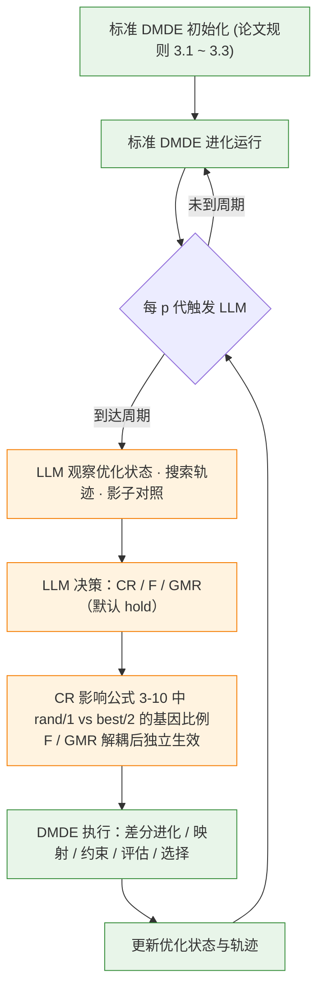
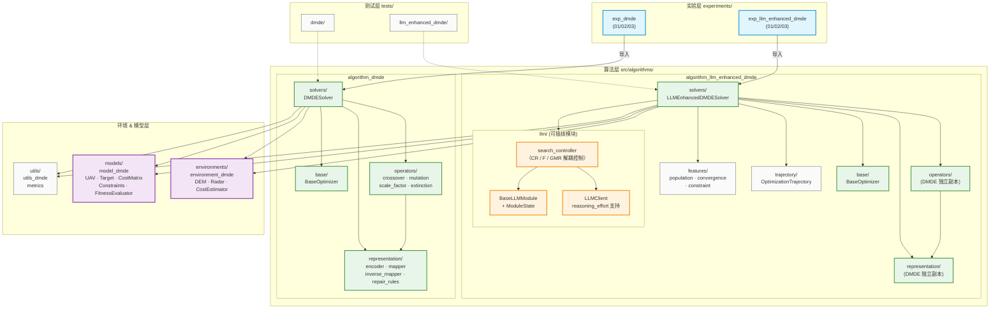

# Experiments-For-Dissertation

> 多无人机协同目标分配实验平台 — 基于离散映射差分进化 (DMDE) 与 LLM 增强

## LLM-DMDE 框架设计

### 概述

LLM-DMDE 采用**单层干预框架**，LLM 只在进化过程中参与一次决策闭环：

**搜索控制（Search Controller）** — 每隔 _p_ 代，LLM 观察当前优化状态与近期搜索轨迹，
自适应调整三个搜索机制参数：

- **CR**（交叉率）：影响公式 3-10 中 `DE/rand/1`（探索）与 `DE/best/2`（开发）的基因比例；
- **F**（缩放因子）：原 DMDE 中由公式 3-11 从 CR 推导，解耦后可独立设定；
- **GMR**（灭绝机制）：原 DMDE 中由公式 3-12 从 CR 推导，解耦后可独立开关。

> 原 DMDE 用手工方程把 CR → F → GMR 绑在一条链上，三者只能协同移动。
> 本框架的核心主张是**解耦**这条链，让 LLM 依据观测状态独立调整三个通道。

通过上述设计，LLM-DMDE 将**高层自适应参数决策**与**低层数值进化**解耦：
LLM 负责"以什么搜索姿态继续"，DMDE 负责差分进化、离散-连续映射、逆映射、
约束处理、目标评估和环境选择。

> 早期版本另有一个 LLM 增强种群初始化模块（PopInit），已从代码库中移除，
> 理由见 `docs/prompt_design_search_controller.md`。

### 核心机制：LLM 通过 CR 控制搜索策略

原始 DMDE 的混合策略（公式 3-10）中，每个基因独立掷骰：

- `rand <= CR` → 使用 `DE/rand/1`（探索）
- `rand > CR` → 使用 `DE/best/2`（开发）

因此 CR 值直接决定了种群中探索与开发的基因比例：

| CR 值   | rand/1 基因比例 | 搜索倾向 | 适用场景               |
| ------- | -------------- | -------- | ---------------------- |
| 0.1/0.3 | 低             | 开发为主 | 多样性高、收敛慢       |
| 0.5     | 中等           | 平衡     | 一般情况               |
| 0.7/0.9 | 高             | 探索为主 | 多样性低、停滞严重     |

LLM 根据优化状态（多样性、停滞、可行解比例等）动态选择 CR，间接控制搜索策略，同时保留原始 DMDE 的逐基因随机混合机制。

### 搜索控制详解

- 进化过程中，LLM 每隔 _p_ 代观察一次当前优化状态和近期搜索轨迹
- 观测特征涵盖：约束可行性（feasible_ratio / violation_mean / violation_max）、
  多样性水平与结构分位数、Δf / ΔD 趋势、接受率、真实停滞代数（未封顶）、
  上次动作、触发原因、冻结标志位，以及最近 5 个 stage 的历史表
- 影子对照（可选）：同起点、固定 CR 的影子种群在同窗口上的增量，作为**可归因锚点**
- 决策协议：**默认 hold** — 对每个通道先回答"要不要改"，只有答"要"才回答"改成什么"
- 冻结守卫：CR 无证据守卫、GMR/F 连续无效动作守卫；冻结时输出被强制为
  `null` / `"auto"` / `"hold"`，并在 prompt 中说明原因
- 三条件动作空间对照（共用同一观测集与守卫，仅"能动什么"不同）：

| 条件 | 动作空间 | CR |
|---|---|---|
| 解耦 | CR + F + GMR | LLM 决策 |
| 耦合 | 仅 CR（F/GMR 由公式跟随） | LLM 决策 |
| 去 CR | F + GMR | 锁定 0.3 |

### LLM 与 DMDE 职责边界

| 职责                   | LLM                          | DMDE                |
| ---------------------- | ---------------------------- | ------------------- |
| 交叉率 CR 确定         | ✅ 自适应选择                | —                   |
| 缩放因子 F 计算        | ✅ 解耦后可独立覆写          | ✅ 未覆写时按公式 3-11 批量计算 |
| 灭绝机制 GMR           | ✅ 解耦后可独立开关          | ✅ 未覆写时按公式 3-12 推导 |
| 混合变异策略执行       | —                            | ✅ 逐基因随机选择 rand/1 或 best/2 |
| 差分进化执行           | —                            | ✅                  |
| 离散-连续映射 / 逆映射 | —                            | ✅                  |
| 约束处理               | —                            | ✅                  |
| 目标评估               | —                            | ✅                  |
| 环境选择               | —                            | ✅                  |
| 搜索状态观测与决策     | ✅ 每 _p_ 代观测并决策       | —                   |

### 框架流程图



---

## 项目架构

### 模块依赖图



### 图例

| 颜色    | 层级     | 说明                                                    |
| ------- | -------- | ------------------------------------------------------- |
| 🔵 蓝色 | 实验层   | `experiments/` — 可运行的实验脚本                       |
| 🟢 绿色 | 算法层   | `src/algorithms/` — DMDE 与 LLM-DMDE 求解器             |
| 🟠 橙色 | LLM 模块 | `llm/modules/` — 可插拔、可消融的 LLM 增强模块          |
| 🟣 紫色 | 核心层   | `environments/` + `models/` — 问题建模与环境            |
| ⚪ 灰色 | 基础层   | `utils/` + `trajectory/` + `features/` — 工具与数据结构 |

---

## 目录结构

```
Experiments-For-Dissertation/
│
├── .env.example                                  # 环境变量模板
├── .gitignore
├── .python-version                               # Python 版本锁定
├── pyproject.toml                                # 项目元数据与依赖声明
├── requirements.txt
├── uv.lock                                       # uv 依赖锁文件
├── README.md
│
├── src/                                          # 核心源码
│   ├── __init__.py
│   ├── algorithms/
│   │   ├── __init__.py
│   │   ├── algorithm_dmde/                       # DMDE 基线算法（第三章）
│   │   │   ├── __init__.py
│   │   │   ├── base/                             # BaseOptimizer + SolverResult
│   │   │   │   ├── __init__.py
│   │   │   │   └── base_optimizer.py
│   │   │   ├── operators/                        # crossover · mutation · scale_factor · extinction
│   │   │   │   ├── __init__.py
│   │   │   │   ├── crossover.py
│   │   │   │   ├── extinction.py
│   │   │   │   ├── mutation.py
│   │   │   │   └── scale_factor.py
│   │   │   ├── representation/                   # 编码 / 映射 / 逆映射 / 修复规则
│   │   │   │   ├── __init__.py
│   │   │   │   ├── encoder.py
│   │   │   │   ├── inverse_mapper.py
│   │   │   │   ├── mapper.py
│   │   │   │   └── repair_rules/
│   │   │   │       ├── __init__.py
│   │   │   │       ├── invalid_mutator.py
│   │   │   │       ├── nearest_match.py
│   │   │   │       └── unique_filter.py
│   │   │   └── solvers/                          # DMDESolver + 基线求解器
│   │   │       ├── __init__.py
│   │   │       ├── dmde_solver.py
│   │   │       └── baseline_solvers/
│   │   │           ├── __init__.py
│   │   │           ├── cmtap_ga.py
│   │   │           ├── pmx_de.py
│   │   │           └── sort_de.py
│   │   │
│   │   └── algorithm_llm_enhanced_dmde/          # LLM 增强 DMDE（独立实现）
│   │       ├── __init__.py
│   │       ├── base/                             # BaseOptimizer（独立副本）
│   │       │   ├── __init__.py
│   │       │   └── base_optimizer.py
│   │       ├── operators/                        # DMDE 算子（独立副本）
│   │       │   ├── __init__.py
│   │       │   ├── crossover.py
│   │       │   ├── extinction.py
│   │       │   ├── mutation.py
│   │       │   └── scale_factor.py
│   │       ├── representation/                   # 编码/映射/修复（独立副本）
│   │       │   ├── __init__.py
│   │       │   ├── encoder.py
│   │       │   ├── inverse_mapper.py
│   │       │   ├── mapper.py
│   │       │   └── repair_rules/
│   │       │       ├── __init__.py
│   │       │       ├── invalid_mutator.py
│   │       │       ├── nearest_match.py
│   │       │       └── unique_filter.py
│   │       ├── solvers/                          # LLMEnhancedDMDESolver
│   │       │   ├── __init__.py
│   │       │   └── llm_enhanced_dmde_solver.py
│   │       ├── llm/                              # LLM 交互层
│   │       │   ├── __init__.py
│   │       │   ├── base_module.py                # BaseLLMModule + ModuleState
│   │       │   ├── llm_client.py                 # OpenAI 兼容 API 客户端（含 reasoning_effort）
│   │       │   └── modules/                      # 可插拔 LLM 模块
│   │       │       ├── __init__.py               # 模块注册表
│   │       │       ├── cr_control.py             # CR 控制模块（已废弃，合并进 search_controller）
│   │       │       ├── operator_selection.py     # 算子选择模块（已废弃，合并进 search_controller）
│   │       │       └── search_controller.py      # 统一搜索控制器（CR / F / GMR 解耦控制）
│   │       ├── features/                         # 搜索状态特征提取
│   │       │   ├── __init__.py
│   │       │   ├── constraint_features.py
│   │       │   ├── convergence_features.py
│   │       │   └── population_features.py
│   │       └── trajectory/                       # OptimizationTrajectory 轨迹记录
│   │           ├── __init__.py
│   │           └── optimization_trajectory.py
│   │
│   ├── environments/                             # 战场环境
│   │   └── environment_dmde/                     # DEM · 雷达 · 代价估算 · 场景转换
│   │       ├── __init__.py
│   │       ├── context.py
│   │       ├── cost_estimator.py
│   │       ├── dem_terrain.py
│   │       ├── radar_threat.py
│   │       └── transition.py
│   │
│   ├── models/                                   # 领域模型
│   │   └── model_dmde/                           # UAV · Target · 约束 · 代价矩阵
│   │       ├── __init__.py
│   │       ├── constraints/
│   │       │   ├── __init__.py
│   │       │   ├── coop_constraints.py
│   │       │   ├── evaluator.py
│   │       │   └── single_constraints.py
│   │       ├── cost/
│   │       │   ├── __init__.py
│   │       │   └── cost_matrix.py
│   │       └── entities/
│   │           ├── __init__.py
│   │           ├── target.py
│   │           └── uav.py
│   │
│   └── utils/                                    # 工具函数
│       └── utils_dmde/
│           ├── __init__.py
│           ├── coord_transform.py                # [新] 坐标变换工具
│           └── metrics.py                        # 评价指标
│
├── experiments/                                  # 实验层
│   ├── exp_dmde/                                 # DMDE 基线实验
│   │   ├── exp_dmde_01/                          # N=M 平衡指派
│   │   │   ├── __init__.py
│   │   │   ├── run.py
│   │   │   ├── data_store.py
│   │   │   ├── plot_from_saved.py
│   │   │   ├── result_table.py
│   │   │   ├── config/
│   │   │   ├── data/                             # DEM 数据 · 矢量边界
│   │   │   │   └── chengguan_district_dem.tif
│   │   │   ├── results/
│   │   │   └── visualization/                    # 可视化脚本
│   │   │       ├── __init__.py
│   │   │       ├── _common.py
│   │   │       ├── plot_assignment.py
│   │   │       ├── plot_comparison.py
│   │   │       ├── plot_convergence.py
│   │   │       ├── plot_cost_matrix.py
│   │   │       ├── plot_dem3d.py
│   │   │       └── visualizer.py
│   │   │
│   │   ├── exp_dmde_02/                          # N>M 多对一
│   │   │   ├── __init__.py
│   │   │   ├── run.py
│   │   │   ├── plot_from_saved.py
│   │   │   ├── result_table.py
│   │   │   ├── config/
│   │   │   ├── data/
│   │   │   └── results/
│   │   │
│   │   └── exp_dmde_03/                          # N<M 群巡游
│   │       ├── __init__.py
│   │       ├── run.py
│   │       ├── plot_from_saved.py
│   │       ├── result_table.py
│   │       ├── config/
│   │       ├── data/
│   │       ├── results/
│   │       └── visualization/
│   │
│   └── exp_llm_enhanced_dmde/                    # LLM 增强实验
│       ├── README.md                             # [新] LLM 实验说明文档
│       │
│       ├── exp_llm_dmde_01/                      # LLM + N=M
│       │   ├── __init__.py
│       │   ├── run.py
│       │   ├── run_batch.py                      # [新] 批量实验运行
│       │   ├── registry.py                       # [新] 实验注册表
│       │   ├── index.json                        # [新] 实验索引
│       │   ├── compare_experiments.py            # 实验对比脚本
│       │   ├── data_store.py
│       │   ├── plot_from_saved.py
│       │   ├── result_table.py
│       │   ├── config/
│       │   │   ├── llm_config.yaml               # LLM 配置
│       │   │   └── prompts/                      # [新] Prompt 模板目录
│       │   │       └── search_controller.txt
│       │   ├── data/
│       │   │   └── chengguan_district_dem.tif
│       │   ├── results/
│       │   ├── comparison_results/               # [新] 对比实验结果
│       │   │   ├── comparison.md
│       │   │   └── figures/
│       │   │       ├── comparison_boxplot.png
│       │   │       └── comparison_convergence.png
│       │   └── visualization/                    # 可视化脚本
│       │       ├── __init__.py
│       │       ├── _common.py
│       │       ├── plot_assignment.py
│       │       ├── plot_comparison.py
│       │       ├── plot_convergence.py
│       │       ├── plot_cost_matrix.py
│       │       ├── plot_dem3d.py
│       │       ├── plot_llm_decisions.py         # LLM 决策可视化
│       │       └── visualizer.py
│       │
│       ├── exp_llm_dmde_02/                      # LLM + N>M
│       │   ├── __init__.py
│       │   ├── run.py
│       │   ├── plot_from_saved.py
│       │   ├── result_table.py
│       │   ├── config/
│       │   │   ├── llm_config.yaml
│       │   │   └── prompts/
│       │   │       └── search_controller.txt
│       │   ├── data/
│       │   └── results/
│       │
│       ├── exp_llm_dmde_03/                      # LLM + N<M
│       │   ├── __init__.py
│       │   ├── run.py
│       │   ├── plot_from_saved.py
│       │   ├── result_table.py
│       │   ├── config/
│       │   │   ├── llm_config.yaml
│       │   │   └── prompts/
│       │   │       └── search_controller.txt
│       │   ├── data/
│       │   └── results/
│       │
│       └── exp_llm_dmde_comparison/              # [新] LLM-DMDE 跨场景对比实验
│           └── run_comparison.py
│
├── tests/                                        # 单元测试
│   ├── dmde/                                     # DMDE 算法测试
│   │   ├── test_regressions.py                   # [新] 回归测试
│   │   └── solver/
│   │       ├── test_encoder.py
│   │       ├── test_mapping_operator.py
│   │       └── test_solver.py
│   │
│   └── llm_enhanced_dmde/                        # LLM 模块测试
│       ├── __init__.py
│       ├── test_feature_extractors.py            # 特征提取器测试
│       ├── test_llm_client.py                    # LLM 客户端测试
│       ├── test_prompt_builder.py                # Prompt 构建器测试
│       ├── test_response_parser.py               # 响应解析器测试
│       ├── test_solver_integration.py            # 求解器集成测试
│       └── test_trajectory_collector.py          # 轨迹收集器测试
│
└── docs/                                         # 文档
    ├── AI_guide/                                 # LLM 增强设计指南
    │   └── LLM_for_DMDE_guide1.md
    ├── DIRECTORY_STRUCTURE.md
    └── references/                               # 参考论文
        ├── Ming2017_*.pdf
        ├── Zhang_2025_*.pdf
        └── 赵明_*.pdf
```

---

## LLM 配置

### 基本配置（llm_config.yaml）

```yaml
provider: deepseek
model: deepseek-flash
temperature: 0.7
max_tokens: 8192
timeout: 60

# 思维链强度：none（最快最省）/ low / high（默认）/ max
reasoning_effort: none

# 截断重试时 max_tokens 加倍的上限
max_tokens_cap: 16384
```

### Prompt 可配置化

不同场景（balanced/overloaded/srp）可在实验配置中定义不同的 system prompt：

```yaml
# llm_config.yaml
modules:
  search_controller:
    enabled: true
    interval: 100
    # 方式 1: 内联（适合短 prompt）
    system_prompt: "You are an expert in DE optimization..."
    # 方式 2: 文件路径（适合长 prompt 或多场景复用）
    # system_prompt_path: config/prompts/search_controller_balanced.txt
```

不指定时使用代码内置的默认 prompt。

### LLM 客户端特性

- **自动重试**：429 限流、5xx 错误、空响应均自动重试（最多 3 次，指数退避）
- **截断保护**：`finish_reason=length` 时自动加倍 `max_tokens` 重试（受 `max_tokens_cap` 约束）
- **reasoning_effort**：通过 `extra_body` 透传给 DeepSeek API，控制 thinking 模式强度
- **错误分类**：`LLMEmptyResponseError` / `LLMTruncatedResponseError` 便于上层模块区分处理

---

## LLM 消融实验

通过 `modules` 配置字典控制 LLM 模块的启用/禁用：

```python
from algorithms.algorithm_llm_enhanced_dmde import LLMEnhancedDMDEConfig

# Vanilla DMDE（无 LLM）
cfg = LLMEnhancedDMDEConfig(modules={})

# 仅搜索控制器（LLM 选择 CR / F / GMR，解耦）
cfg = LLMEnhancedDMDEConfig(modules={
    "search_controller": {"enabled": True, "interval": 100}
})

# 耦合对照（只放开 CR 通道，F/GMR 由公式跟随）
cfg = LLMEnhancedDMDEConfig(modules={
    "search_controller": {"enabled": True, "interval": 100, "coupled": True}
})

# 去 CR 对照（CR 锁定，只放开 F / GMR）
cfg = LLMEnhancedDMDEConfig(modules={
    "search_controller": {"enabled": True, "interval": 100, "no_cr": True}
})
```

---

## 快速开始

```bash
# 安装依赖
uv sync

# 配置 API Key
cp .env.example .env
# 编辑 .env 填入 DEEPSEEK_API_KEY

# 运行 DMDE 基线实验
uv run python experiments/exp_dmde/exp_dmde_01/run.py

# 运行 LLM 增强实验（需配置 API）
uv run python experiments/exp_llm_enhanced_dmde/exp_llm_dmde_01/run.py

# 运行消融实验（S1/S2 × A0/A1，详见 experiments/exp_ablation_study/README.md）
uv run python experiments/exp_ablation_study/run_ablation.py --runs 30

# 运行测试
pytest tests/
```
