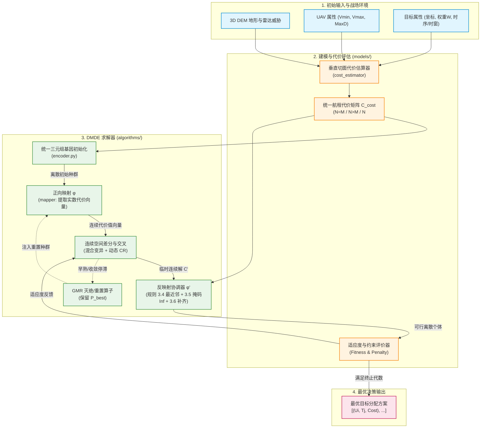
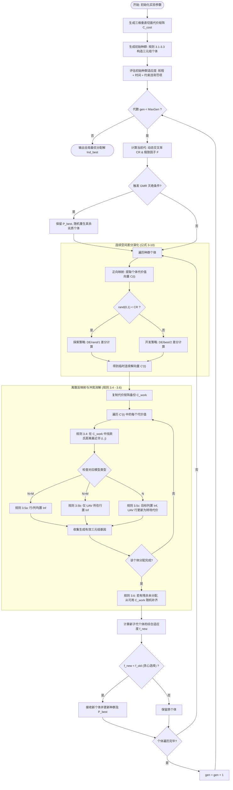

# Experiments-For-Dissertation — 项目目录结构

> 生成日期：2026-09-08
> 说明：本文档为项目完整目录结构（已排除 `.git`、`.venv`、`__pycache__` 等无关内容）。

## 目录树

```
Experiments-For-Dissertation/
│
├── .gitignore                  # Git 忽略规则
├── .python-version             # Python 版本声明
├── pyproject.toml              # 项目配置与依赖声明
├── README.md                   # 项目说明
├── uv.lock                     # uv 依赖锁文件
│
├── docs/                       # 项目文档目录
│
├── src/                        # 核心源码（库代码）
│   ├── __init__.py
│   │
│   ├── algorithms/             # 优化算法层
│   │   ├── __init__.py
│   │   └── algorithm_dmde/     # DMDE（离散映射差分进化）算法
│   │       ├── __init__.py
│   │       │
│   │       ├── base/           # 基类 / 接口规范
│   │       │   ├── __init__.py
│   │       │   └── base_optimizer.py    # 优化器接口规范
│   │       │
│   │       ├── operators/      # 连续差分进化算子
│   │       │   ├── __init__.py
│   │       │   ├── crossover.py          # 交叉算子
│   │       │   ├── extinction.py         # 灭绝/重启机制
│   │       │   ├── mutation.py           # 变异算子
│   │       │   └── scale_factor.py       # 缩放因子自适应
│   │       │
│   │       ├── representation/ # 基因表征与空间映射机制
│   │       │   ├── __init__.py
│   │       │   ├── encoder.py            # 统一三元组基因生成器（规则 3.1-3.3）
│   │       │   ├── mapper.py             # 离散→连续正向映射 phi（公式 3-5）
│   │       │   ├── inverse_mapper.py     # 连续→离散反映射 phi'（公式 3-7）
│   │       │   └── repair_rules/         # 反映射冲突消解策略簇（规则 3.4-3.6）
│   │       │       ├── __init__.py
│   │       │       ├── invalid_mutator.py    # 规则 3.6：越界/重复/无效值随机变异修补
│   │       │       ├── nearest_match.py      # 规则 3.4：最近邻空间欧氏距离匹配
│   │       │       └── unique_filter.py      # 规则 3.5：独占分配与掩码(Inf)行/列剔除
│   │       │
│   │       └── solvers/        # 求解器实现层
│   │           ├── __init__.py
│   │           ├── dmde_solver.py          # 离散映射差分求解器（算法 3.1 完整流程）
│   │           └── baseline_solvers/       # 论文对比算法（第三章表 3-5）
│   │               ├── __init__.py
│   │               ├── cmtap_ga.py         # 协同多目标遗传算法（文献[65]）
│   │               ├── pmx_de.py           # 部分映射交叉差分算法
│   │               └── sort_de.py          # 排序差分进化算法（文献[105]）
│   │
│   ├── environments/           # 环境层
│   │   ├── __init__.py
│   │   └── env_dmde/           # DMDE 问题环境
│   │       ├── __init__.py
│   │       ├── context.py      # 环境上下文
│   │       ├── evaluator.py    # 评估器
│   │       ├── instance.py     # 实例定义
│   │       └── transition.py   # 状态转移
│   │
│   ├── models/                 # 领域模型层
│   │   ├── __init__.py
│   │   └── model_dmde/
│   │       ├── __init__.py
│   │       ├── constraints/    # 约束建模
│   │       │   └── __init__.py
│   │       ├── cost/           # 成本/目标建模
│   │       │   └── __init__.py
│   │       └── entities/       # 实体定义
│   │           └── __init__.py
│   │
│   └── utils/                  # 工具层
│       ├── __init__.py
│       └── utils_dmde/
│           ├── __init__.py
│           └── metrics.py      # 评价指标
│
├── experiments/                # 实验层
│   └── exp_dmde/
│       └── exp_dmde_01/
│           ├── __init__.py
│           ├── config/         # 实验配置
│           │   └── .gitkeep
│           ├── data/           # 实验数据
│           │   └── .gitkeep
│           ├── results/        # 实验结果
│           │   └── .gitkeep
│           └── visualization/  # 可视化脚本/图表
│
└── tests/                      # 测试层
    └── dmde/
        └── solver/
            ├── test_encoder.py            # 编码器测试
            ├── test_mapping_operator.py   # 映射算子测试
            └── test_solver.py             # 求解器测试
```

## 模块职责速览

| 层级 | 路径                             | 职责                                        |
| ---- | -------------------------------- | ------------------------------------------- |
| 算法 | `src/algorithms/algorithm_dmde/` | DMDE 算法主体：算子、表征、求解器           |
| 表征 | `.../representation/`            | 离散三元组基因编码 ↔ 连续空间映射及冲突修复 |
| 求解 | `.../solvers/`                   | DMDE 主求解流程 + 论文对比基线算法          |
| 环境 | `src/environments/env_dmde/`     | 问题实例、评估与状态转移                    |
| 模型 | `src/models/model_dmde/`         | 约束、成本、实体等领域建模                  |
| 工具 | `src/utils/utils_dmde/`          | 通用指标与辅助工具                          |
| 实验 | `experiments/exp_dmde/`          | 实验配置、数据、结果与可视化                |
| 测试 | `tests/dmde/`                    | 编码、映射算子与求解器单元测试              |

## 核心数据流

```
encoder(离散基因) --mapper.phi--> 连续个体
    --(DE 算子进化)--> 连续个体 --inverse_mapper.phi'--> 离散基因
inverse_mapper 还原过程中按需调用 repair_rules 消解各类冲突
最终由 dmde_solver 编排并输出结果，与 baseline_solvers 统一口径对比
```

```
[场景输入 (UAV参数/Target参数/地形雷达/协同约束)]
                       │
                       ▼
         models/model_dmde/cost/
     (垂直切面法生成统一代价矩阵 C_cost)
                       │
       ┌───────────────┴───────────────┐
       ▼                               ▼
algorithms/.../encoder.py       models/.../constraints/
 (按规则3.1-3.3初始化三元组个体)  (单机/协同约束检测与适应度函数)
       │                               ▲
       ▼                               │
algorithms/.../mapper.py               │
 (提取三元组代价值为连续向量)           │
       │                               │
       ▼                               │
algorithms/.../operators/              │
 (混合差变异 + 动态CR + GMR灭绝)       │
       │ (得到连续实数解 C')           │
       ▼                               │
algorithms/.../inverse_mapper.py       │
 (基于规则3.4-3.6掩码消解，映射回三元组) │
       │                               │
       ▼ (得到可行分配个体)             │
       └───────────────────────────────┘
```

## 流程图




